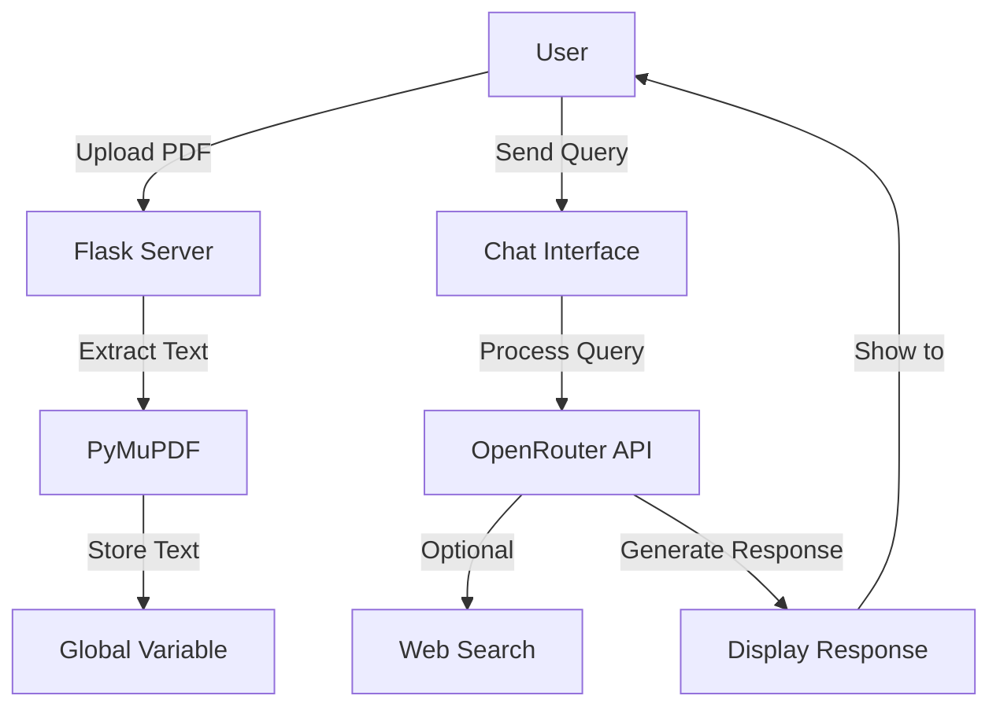

# PDF Insight AI

A Flask-based web application that allows users to upload PDFs and interact with them using AI-powered analysis and chat functionality.

## Purpose of Each File

- `app.py`: Core application file containing:
  - Flask server setup and routing
  - PDF processing logic using PyMuPDF
  - Chat functionality with OpenRouter API integration
  - Web search capabilities using DuckDuckGo
  - File upload handling and text extraction

- `templates/index.html`: Frontend interface featuring:
  - Modern dark/light theme support
  - Responsive design with Tailwind CSS
  - File drag-and-drop functionality
  - Real-time chat interface
  - Markdown rendering support

- `requirements.txt`: Dependencies list:
  - Flask 3.0.2: Web framework
  - PyPDF2 3.0.1: PDF processing
  - python-dotenv 1.0.0: Environment variable management
  - requests 2.31.0: HTTP requests
  - PyMuPDF 1.23.8: PDF text extraction

- `uploads/`: Directory for storing uploaded PDF files (not tracked in git)

## Process Flow



## Quick Start

### Prerequisites
- Python 3.8+
- OpenRouter API key

### Windows
```bash
# Clone repository
git clone [repository-url]
cd pdf-analyzer-ai

# Create virtual environment
python -m venv venv
.\venv\Scripts\activate

# Install dependencies
pip install -r requirements.txt

# Set environment variables
set OPENROUTER_API_KEY=your_api_key

# Run application
python app.py
```

### Linux/Ubuntu
```bash
# Clone repository
git clone [repository-url]
cd pdf-analyzer-ai

# Create virtual environment
python3 -m venv venv
source venv/bin/activate

# Install dependencies
pip install -r requirements.txt

# Set environment variables
export OPENROUTER_API_KEY=your_api_key

# Run application
python app.py
```

## Security Features

The application implements several security measures:

1. **Input Validation**
   - PDF file type validation using magic numbers
   - File size limits (10MB max)
   - Secure filename handling
   - Only allows PDF file extensions

2. **CORS Protection**
   - Restricted to localhost:5000
   - Limited HTTP methods (GET, POST)
   - Controlled headers

3. **Security Headers**
   - Content Security Policy (CSP)
   - X-Content-Type-Options
   - X-Frame-Options
   - X-XSS-Protection

4. **Environment Security**
   - API keys stored in .env file
   - Uploads directory gitignored
   - Dependencies regularly updated for security patches

## Data Privacy Disclaimer

**Important**: This application processes PDF documents using AI services. Please note:

1. PDF text content is extracted locally but sent to OpenRouter API for analysis
2. When web search is enabled, queries are sent to DuckDuckGo
3. No PDF content is permanently stored on external servers
4. Uploaded PDFs are stored locally in the `uploads` directory
5. Consider data sensitivity before uploading confidential documents

## Additional Information

- Supports multiple AI models through OpenRouter:
  - DeepSeek R1
  - Gemini Flash
  - Gemini Pro
  - DeepSeek R1 Distill
- Maximum file size: 16MB
- Supports PDF text extraction and analysis
- Real-time chat interface with markdown support
- Optional web search integration for enhanced responses
